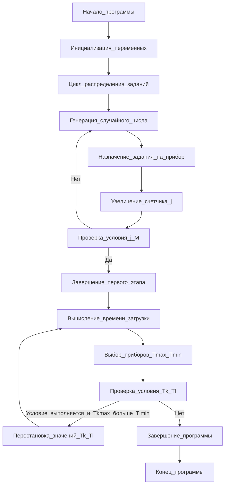

```mermaid
graph TD;
    Начало_программы --> Инициализация_переменных;
    Инициализация_переменных --> Цикл_распределения_заданий;
    Цикл_распределения_заданий --> Генерация_случайного_числа;
    Генерация_случайного_числа --> Назначение_задания_на_прибор;
    Назначение_задания_на_прибор --> Увеличение_счетчика_j;
    Увеличение_счетчика_j --> Проверка_условия_j_M;
    Проверка_условия_j_M -- Да --> Завершение_первого_этапа;
    Проверка_условия_j_M -- Нет --> Генерация_случайного_числа;
    Завершение_первого_этапа --> Вычисление_времени_загрузки;
    Вычисление_времени_загрузки --> Выбор_приборов_Tmax_Tmin;
    Выбор_приборов_Tmax_Tmin --> Проверка_условия_Tk_Tl;
    Проверка_условия_Tk_Tl -- Условие_выполняется_и_Tkmax_больше_Tlmin --> Перестановка_значений_Tk_Tl;
    Перестановка_значений_Tk_Tl --> Вычисление_времени_загрузки;
    Проверка_условия_Tk_Tl -- Нет --> Завершение_программы;
    Завершение_программы --> Конец_программы;
```